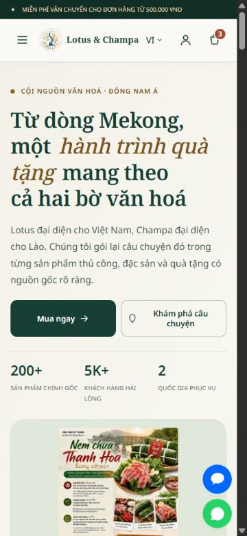
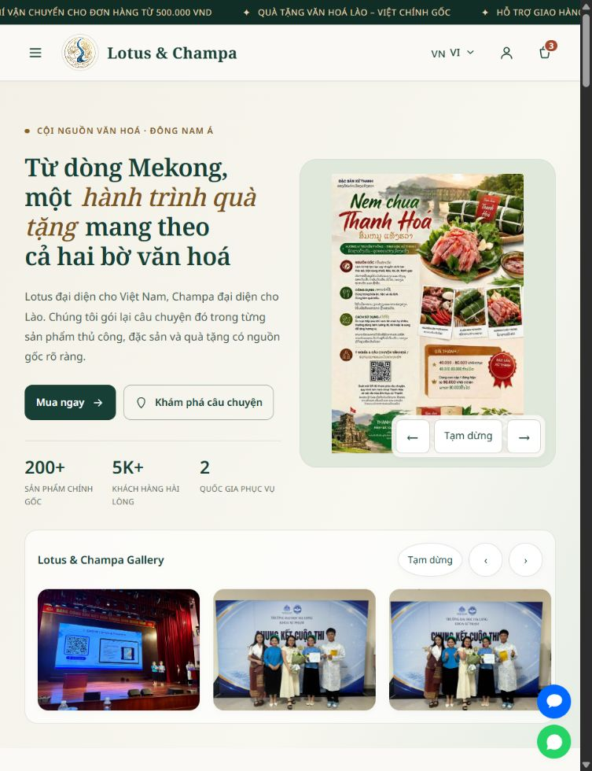
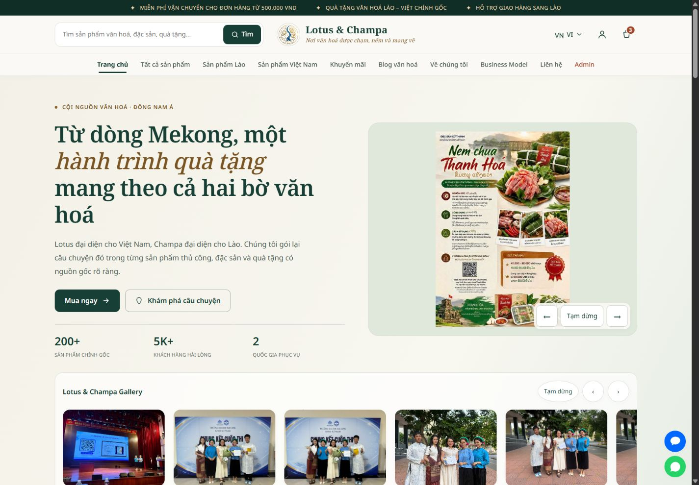

# ผลตรวจและปรับปรุง Lotus & Champa

ตรวจวันที่ 7 ตุลาคม 2026 ที่ https://phiphakone.github.io/quiz/#/ และทดสอบฉบับแก้ไขบนเครื่อง

ตรวจ SHA-256 แล้ว: `index.html` จากโฟลเดอร์ที่ผู้ใช้ให้ตรงกับ HTML ที่ดาวน์โหลดจากเว็บไซต์จริง ดังนั้นฉบับแก้ไขใช้ฐานเดียวกับเว็บไซต์ออนไลน์ที่ตรวจ

## ปัญหาเดิมและการแก้ไข

| จุดตรวจ | ปัญหาเดิม | ผลที่ปรับแล้ว |
|---|---|---|
| หน้าแรก | หัวเรื่องใหญ่และขึ้นหลายบรรทัด ทำให้ภาพและสินค้าลงไปไกล | ลดขนาดหัวเรื่อง จัดข้อความและภาพเป็นสองคอลัมน์บนจอใหญ่ และเรียงบนมือถือ |
| สีและความชัด | สีทองบนพื้นอ่อนและปุ่ม WhatsApp บางแห่งมีความต่างสีต่ำ | ใช้เขียวเข้มกับงาช้าง ปรับทองและปุ่มติดต่อให้ข้อความอ่านง่าย |
| การ์ดสินค้า | ข้อความและปุ่มแออัดบนมือถือ | จัดราคาให้ขึ้นบรรทัดได้ ปุ่มซื้อมีข้อความและพื้นที่กดชัดเจน |
| ตะกร้า | การจัดคอลัมน์มือถือทำให้ราคาทับปุ่มเพิ่มจำนวน | แยกแถวข้อมูล จำนวน ราคา และปุ่มลบ ทดสอบกดเพิ่มจำนวนและยอดรวมแล้ว |
| เมนู | เมนูปิดยังมีองค์ประกอบที่คีย์บอร์ดเข้าถึงได้ | ใช้ inert เมื่อปิด มีชื่อเมนู สถานะเปิด/ปิด วนโฟกัสและปิดด้วย Escape |
| การค้นหา | บนมือถือซ่อนอยู่ในเมนู ช่องค้นหาบางส่วนไม่มีชื่อสำหรับตัวอ่านหน้าจอ | ใส่ชื่อให้ช่องและปุ่ม ค้นหาในเมนูได้ทั้งปุ่มและ Enter |
| ตัวกรอง | ลิงก์ OCOP ใช้ชื่อหมวดที่ไม่ตรงข้อมูลป้ายสินค้า ตัวพิมพ์ของบางป้ายไม่ตรง | กรอง OCOP จากป้ายสินค้า เปรียบเทียบป้ายโดยไม่แยกตัวพิมพ์ และแสดงค่าการเรียงตรงกับ URL |
| บล็อก | การ์ดใช้ onclick และลิงก์อ่านต่อไม่มี href | ใช้ลิงก์จริงที่ภาพ หัวเรื่อง และอ่านต่อ เปิดด้วยคีย์บอร์ดหรือแท็บใหม่ได้ |
| Accessibility | label บางแห่งไม่เชื่อมช่องกรอก ปุ่มโปรดซ้อนในลิงก์ รูปกดได้บางแห่งใช้คีย์บอร์ดไม่ได้ | ผูก label กับช่องกรอก ย้ายปุ่มโปรด เพิ่มการกด Enter/Space และโฟกัสที่มองเห็น |
| ภาพเคลื่อนไหว | ภาพเลื่อนอัตโนมัติ ไม่มีปุ่มหยุด | เพิ่มปุ่มหยุด/เล่น และเคารพ prefers-reduced-motion |
| โหลดหน้า | ฝังภาพ Base64 ทำให้ HTML ประมาณ 4.56 MB | แยกภาพ 25 ไฟล์ รักษาไบต์เดิม โหลดภาพรองเมื่อจำเป็น HTML เหลือประมาณ 0.54 MB |

## ผลทดสอบ

- ตรวจ 174 กรณี: 58 เส้นทาง × 3 ขนาด ครอบคลุมหน้าสินค้าทั้ง 41 รายการและหน้าหลัก
- ขนาด 375px, 768px และ 1440px: ไม่พบภาพเสียหรือองค์ประกอบเนื้อหาล้นขอบจอในการตรวจ DOM และ layout ที่ทดสอบ
- พบช่องตะกร้าที่ขาดชื่อในรอบแรก แล้วแก้และตรวจซ้ำทั้งสามขนาดผ่าน บันทึกผลก่อนแก้และผลตรวจซ้ำแยกกันใน `browser-audit.json`
- ตรวจการแสดงผลหน้าแรกทั้งเวียดนาม ลาว ไทย จีน และอังกฤษ ไม่พบการล้นจอในการตรวจนี้
- การค้นหา Kaipen ได้สินค้า 1 รายการ ตัวกรองลาวได้ 14 รายการ OCOP ได้ 12 รายการ และการเรียงราคาต่ำไปสูงทำงาน
- ทดสอบเพิ่มสินค้าในตะกร้า เพิ่มจำนวนด้วยเมาส์และคีย์บอร์ด คูปอง FREESHIP และเปิดขั้นตอนสั่งซื้อ ยอดรวมเปลี่ยนตามจำนวนและค่าขนส่งเป็นศูนย์เมื่อใช้คูปอง
- ตรวจเมนูด้วย Shift+Tab/Tab: โฟกัสวนอยู่ในเมนู และ Escape คืนโฟกัสไปปุ่มเมนู เปิดหน้าต่างภาพด้วย Enter ได้
- ตรวจข้อความ 1,232 จุดใน 8 หน้าตัวแทนหลังแก้สี โดยใช้สีพื้น/สีข้อความที่คำนวณจาก CSS และเกณฑ์ 4.5:1 สำหรับข้อความปกติ หรือ 3:1 สำหรับข้อความใหญ่ ไม่พบจุดต่ำกว่าเกณฑ์ในชุดนี้
- ตรวจ syntax ของ JavaScript ทั้งสคริปต์เดิมและไฟล์ที่เพิ่ม ไม่พบข้อผิดพลาด

การตรวจนี้ไม่ใช่การรับรอง WCAG ทั้งเว็บไซต์ และไม่ได้ทดสอบด้วยโปรแกรมอ่านหน้าจอทุกชนิด ข้อความบนภาพและเนื้อหาที่ผู้ดูแลเพิ่มภายหลังอยู่นอกการวัดความต่างสีของข้อความ DOM

## ลิงก์และความเร็ว

หน้าเว็บจริงตอบ HTTP 200 ทั้งสามครั้ง ระยะรับ HTML บนการเชื่อมต่อที่ใช้ตรวจคือ 1,268 / 408 / 366 ms ตัวเลขนี้วัดคำขอ HTML ไม่ใช่เวลาที่หน้าเว็บพร้อมใช้งานทั้งหมด และไม่ใช่ค่า LCP/INP/CLS

HTML ลดจาก 4,555,878 เป็น 543,715 ไบต์ หรือประมาณ 88.07% ส่วนขนาด gzip ที่คำนวณในเครื่องลดจาก 3,149,320 เป็น 132,826 ไบต์ ภาพยังต้องโหลดแยกตามการใช้งาน จึงไม่ได้หมายความว่าทราฟฟิกภาพรวมลดลงเท่ากัน ภาพแยกช่วยให้แคชและ lazy loading ทำงานได้ดีขึ้น

Facebook, Zalo และ WhatsApp ตอบ HTTP 200 ลิงก์ Zalo เปลี่ยนไปหน้าล็อกอิน ส่วน WhatsApp เปลี่ยนไปหน้าสนทนาหมายเลขเดิม ไม่ได้ส่งข้อความจริง และ HTTP 200 ไม่ยืนยันว่าเจ้าของบัญชีตรงกับร้าน

ลิงก์ Facebook เดิมชี้ `https://facebook.com` ไม่มี URL เพจเฉพาะ จึงรักษาไว้และต้องให้เจ้าของร้านระบุเพจที่ถูกต้อง ลิงก์นโยบายทั้งห้ารายการเดิมไปหน้าติดต่อ ยังรักษาปลายทางและเนื้อหาเดิม ไม่ได้สร้างข้อกำหนดหรือนโยบายใหม่แทนเจ้าของร้าน

ฉบับปรับปรุงยังไม่เผยแพร่ จึงยังวัดความเร็วบน GitHub Pages ของฉบับใหม่นี้ไม่ได้ เวลาโหลดบน localhost ไม่ใช้เปรียบเทียบเป็นเปอร์เซ็นต์ความเร็วกับเว็บจริง Google Fonts, Swiper และ Firebase ยังใช้ปลายทางเดิมและต้องมีอินเทอร์เน็ต

## ข้อมูลและส่วนที่ต้องใช้บัญชีจริง

ตรวจเปรียบเทียบข้อมูลเริ่มต้นสินค้า คำแปลสินค้า บล็อก คำแปลหน้าเว็บ โมดูล Firebase คีย์ข้อมูลและเวอร์ชันแล้วเหมือนต้นฉบับ ไฟล์เดิมอีก 61 ไฟล์ยังเหมือนเดิมทุกไบต์ ภาพที่แยกออกมา 25 ภาพผ่านการตรวจ SHA-256 และเส้นทางไฟล์ครบ ไม่ได้แก้ firestore.rules หรือ storage.rules

ยังไม่ได้ทดสอบการเข้าสู่ระบบด้วยบัญชีจริง การสมัคร/รีเซ็ตรหัสผ่าน การสร้างคำสั่งซื้อจริง การชำระเงิน การอัปโหลด หรือการแก้สินค้า/คำสั่งซื้อในระบบผู้ดูแล เพื่อรักษาข้อมูลที่กำลังใช้งาน การตั้งค่า Authorized domains ของ Firebase สำหรับ localhost อาจต่างจากโดเมนจริง

แบบฟอร์มติดต่อเดิมแสดงข้อความขอบคุณ แต่ในโค้ดยังไม่ได้เชื่อมระบบส่งอีเมล ปุ่มบัตรเครดิตเดิมระบุว่าเป็น demo การปรับครั้งนี้รักษาพฤติกรรมเหล่านี้และไม่ได้อ้างว่าเปิดระบบส่งหรือรับเงินจริงแล้ว

## ภาพตรวจ

### มือถือ 375px

### แท็บเล็ต 768px

### คอมพิวเตอร์ 1440px

ไฟล์ผลตรวจแบบละเอียดอยู่ใน `verification.json`, `live-source-match.json`, `network-check.json` และ `browser-audit.json`

## การแก้ข้อความเพิ่มเติมตามคำขอ 7 ตุลาคม 2026

ปรับหน้าเกี่ยวกับเราทั้งสามย่อหน้าและคำแปลทั้งห้าภาษาให้แนะนำกลุ่มนักศึกษาลาวและนักศึกษาเวียดนาม ปรับจุดเด่นและชุมชนพันธมิตรในหน้าโมเดลธุรกิจให้สอดคล้องกัน และปรับบทความเรื่องราวแบรนด์ b5 กับข้อความย่อให้ใช้มุมมองของทีม

ผลตรวจความเหมือนของคำแปลและบล็อกในรายงานเดิมเป็นผลก่อนการแก้ข้อความครั้งนี้ ซึ่งผู้ใช้ได้ร้องขอให้แก้โดยตรง ข้อมูลสินค้า คำแปลสินค้า การเชื่อมต่อ Firebase และการเริ่มต้นข้อมูลยังเหมือนฉบับก่อนแก้ข้อความ ไม่เปลี่ยน DATA_VERSION และไม่ล้างข้อมูลเบราว์เซอร์ บทความเดิมที่แคชไว้จะแสดงข้อความใหม่เฉพาะช่องที่ยังตรงกับข้อความเริ่มต้นเดิม โดยไม่ทับเนื้อหาที่ผู้ดูแลแก้เอง

ตรวจหน้าเกี่ยวกับเราและโมเดลธุรกิจทั้งห้าภาษา ไม่พบภาพเสียหรือเนื้อหาล้นจอในชุดตรวจนี้ บทความ b5 แสดงข้อความทีมใหม่ในเบราว์เซอร์ที่มีแคชเดิมแล้ว

## ภาพประกอบหน้าเกี่ยวกับเรา — 8 ตุลาคม 2026
สร้างภาพใหม่ด้วย imagegen ตามเรื่องราวนักศึกษาลาว–เวียดนามและงานฝีมือ เปลี่ยนเฉพาะภาพหลักที่ผู้ใช้เลือก เก็บภาพผ้าเดิมและแกลเลอรีไว้ เพิ่ม alt ครบ 5 ภาษา ตรวจ 375/768/1440px: ภาพโหลดครบ ไม่มีหน้าจอล้น ตรวจไวยากรณ์ JavaScript ผ่าน ยังไม่ได้เผยแพร่เว็บไซต์ออนไลน์

## หมวดหมู่วัฒนธรรม — 8 ตุลาคม 2026
ปรับหัวข้อและเรื่องราวสั้นของหกหมวด ครบ 5 ภาษา ใช้ไอคอน SVG และลิงก์จริง มีสถานะโฟกัสคีย์บอร์ด รูปแบบ 2 คอลัมน์บนมือถือและ 3 คอลัมน์บนหน้าจอใหญ่ ตรวจขนาดจริง 375/768/1440px ไม่มีข้อความหรือการ์ดล้น คลิกลิงก์ครบ 6 หมวดได้สินค้า 41/14/27/12/22/7 ตามลำดับ ไม่เปลี่ยนสินค้าหรือข้อมูลแคช

## สัญลักษณ์หมวดหมู่ — 8 ตุลาคม 2026
ปรับสัญลักษณ์ทั้งหกหมวดเป็น SVG วาดเฉพาะแบรนด์ ใช้ดอกบัวคู่ดอกจำปาสื่อการเชื่อมโยง กรอบวงกลมสีเขียวและทอง เก็บไฟล์ SVG แยกใน images/category-symbols ตรวจ 375/768/1440px ไม่มีการ์ดล้น ลิงก์เดิมครบทั้งหก ไม่แก้ข้อมูลสินค้า

